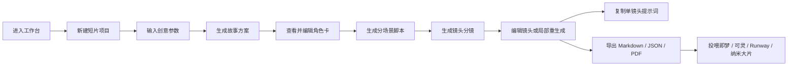

# 用户流程设计

相关低保真线框图说明见：`docs/prd/wireframes.md`

Figma 原型记录见：`docs/prd/figma-prototype.md`

## 1. 核心流程

## 2. 页面 1：工作台

### 页面目标

让用户快速开始一个新项目，并能回到历史项目。

### 关键模块

- 新建项目按钮。
- 最近项目列表。
- 项目状态：草稿、已生成、已导出。
- 最近导出文件。

### 用户操作

- 点击“新建短片项目”。
- 打开历史项目。
- 复制已有项目作为模板。

## 3. 页面 2：新建项目

### 页面目标

收集生成所需的最小输入。

### 表单字段

- 一句话创意。
- 题材。
- 风格。
- 时长。
- 平台。
- 目标受众。
- 主角设定。
- 情绪基调。
- 生成语言。

### 设计原则

- 表单不能太长，否则新手会放弃。
- 必填字段控制在 5 个以内：创意、题材、风格、时长、平台。
- 受众、主角、情绪可作为高级选项。

### 下一步

点击“生成故事方案”。

## 4. 页面 3：脚本生成页

### 页面目标

把一句创意变成用户能理解的故事方案。

### 关键模块

- 标题。
- 一句话卖点。
- 故事梗概。
- 三幕结构。
- 情绪曲线。
- 核心视觉符号。
- 角色卡。

### 用户操作

- 编辑故事梗概。
- 修改三幕结构。
- 修改角色外貌和动机。
- 点击“生成分场景脚本”。

### 产品细节

这里不要直接给用户上 20 个镜头，否则信息量太大。先让用户确认故事和角色，再进入分镜。

## 5. 页面 4：分镜编辑页

### 页面目标

这是产品核心页面。用户在这里把故事变成可执行镜头。

### 推荐布局

左侧：

- 场景列表。
- 总时长。
- 当前情绪节奏。

中间：

- 镜头卡片或分镜表格。
- 每个镜头显示：画面、时长、景别、运镜、旁白、字幕、提示词。

右侧：

- 当前镜头详情编辑。
- 局部重生成要求输入框。
- 复制提示词按钮。

### 镜头字段

- 镜头编号。
- 场景编号。
- 时长。
- 景别。
- 运镜。
- 画面描述。
- 角色动作。
- 台词 / 旁白。
- 字幕。
- 音效 / 音乐。
- 通用视频提示词。
- 工具适配提示词。
- 负向提示词。

### 用户操作

- 编辑单个镜头。
- 复制单条提示词。
- 对某个镜头局部重生成。
- 对某个场景局部重生成。
- 调整镜头顺序。
- 删除或新增镜头。

## 6. 页面 5：导出页

### 页面目标

把项目结果变成下游工具和面试展示都能使用的格式。

### 导出格式

- Markdown：适合文档和作品集。
- JSON：适合后续导入、调试、二次开发。
- PDF：适合面试展示和方案评审。

### 导出内容

- 项目基本信息。
- 故事方案。
- 角色卡。
- 分场景脚本。
- 镜头分镜表。
- 视频提示词表。
- 下游工具使用建议。

## 7. 页面 6：历史项目页

### 页面目标

让用户管理自己的创作方案。

### 关键模块

- 项目列表。
- 创建时间。
- 最近更新时间。
- 项目状态。
- 版本数量。
- 导出记录。

### 用户操作

- 打开项目。
- 复制项目。
- 删除项目。
- 查看版本历史。

## 8. MVP 流程闭环

第一版必须跑通这个闭环：

1. 用户输入一句创意和几个参数。
2. 系统生成故事方案。
3. 系统生成分镜表。
4. 用户编辑一个镜头。
5. 用户复制提示词。
6. 用户导出 Markdown 或 JSON。

只要这个闭环能跑通，就已经是一个完整的 AI 产品 MVP。

## 9. 面试可讲版本

我把用户流程拆成“创意输入、故事确认、分镜编辑、局部重生成、导出投喂”五步，而不是让用户一键生成全部内容。原因是短片创作本身需要反复确认和修改，如果直接一次性生成完整内容，用户很难控制质量，也不容易定位问题。通过分阶段流程，用户可以先确认故事和角色，再进入镜头级编辑，这样更符合真实创作习惯。
