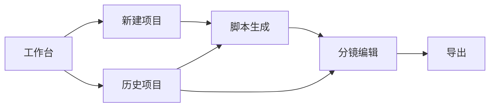

# 低保真页面流程与线框图说明

目标：画清楚 CineFlow AI 的 6 个核心页面，让后续原型设计、前端开发和面试讲述都有统一依据。

页面顺序：

1. 工作台
2. 新建项目
3. 脚本生成
4. 分镜编辑
5. 导出
6. 历史项目

## 1. 全局导航与信息架构

### 导航结构

```text
┌────────────────────────────────────────────────────────────┐
│ CineFlow AI                         新建项目  历史项目  设置 │
├────────────────────────────────────────────────────────────┤
│                                                            │
│                     当前页面内容区                         │
│                                                            │
└────────────────────────────────────────────────────────────┘
```

### 全局页面关系



### 全局状态

- 草稿：只创建了项目，还没有生成内容。
- 已生成脚本：完成故事方案和角色卡。
- 已生成分镜：完成镜头脚本。
- 已导出：生成过 Markdown / JSON / PDF。

## 2. 页面一：工作台

### 页面目标

让用户快速开始创作，并看到最近项目状态。

### 输入

- 无强制输入。
- 可选：搜索项目名称、筛选项目状态。

### 输出

- 最近项目列表。
- 最近导出记录。
- 推荐示例项目入口。

### 主要操作

- 新建短片项目。
- 打开最近项目。
- 复制示例项目。
- 进入历史项目页。

### 低保真线框

```text
┌────────────────────────────────────────────────────────────┐
│ CineFlow AI                         新建项目  历史项目  设置 │
├────────────────────────────────────────────────────────────┤
│ 工作台                                                     │
│ 把一句创意变成可投喂 AI 视频工具的脚本和分镜。              │
│                                                            │
│ [ 新建短片项目 ]                                           │
│                                                            │
│ ┌──────────────────────┐ ┌──────────────────────┐         │
│ │ 最近项目             │ │ 最近导出             │         │
│ │ - 雨夜遇见未来自己   │ │ - Markdown 方案       │         │
│ │   已生成分镜         │ │ - JSON 项目文件       │         │
│ │ - AI 会议纪要广告    │ │ - PDF 展示稿          │         │
│ │   草稿               │ │                      │         │
│ └──────────────────────┘ └──────────────────────┘         │
│                                                            │
│ 示例模板                                                   │
│ [剧情短片] [产品广告] [知识科普] [情绪短片]                 │
└────────────────────────────────────────────────────────────┘
```

### 页面说明

工作台不做复杂营销页，直接进入产品使用场景。核心按钮是“新建短片项目”，历史项目用于承接用户回来继续编辑。

### 下一步

用户点击“新建短片项目”进入新建项目页。

## 3. 页面二：新建项目

### 页面目标

收集 AI 生成所需的最小创作参数。

### 输入

必填：

- 一句话创意。
- 题材。
- 风格。
- 时长。
- 平台。

选填：

- 目标受众。
- 主角设定。
- 情绪基调。
- 生成语言。

### 输出

- 一个项目草稿。
- 一组用于生成故事方案的结构化参数。

### 主要操作

- 填写创意。
- 选择题材、风格、时长、平台。
- 展开高级设置。
- 生成故事方案。
- 保存草稿。

### 低保真线框

```text
┌────────────────────────────────────────────────────────────┐
│ ← 返回工作台                                      保存草稿 │
├────────────────────────────────────────────────────────────┤
│ 新建短片项目                                               │
│                                                            │
│ 一句话创意 *                                               │
│ ┌────────────────────────────────────────────────────────┐ │
│ │ 一个失眠的女孩在雨夜遇见未来的自己                     │ │
│ └────────────────────────────────────────────────────────┘ │
│                                                            │
│ 题材 *        [剧情 ▼]                                    │
│ 风格 *        [电影感 / 治愈 / 轻科幻 ▼]                   │
│ 时长 *        [60 秒 ▼]                                   │
│ 平台 *        [抖音 / 小红书 ▼]                            │
│                                                            │
│ 高级设置                                                   │
│ 目标受众      [18 到 30 岁年轻女性]                        │
│ 主角设定      [20 岁，长期失眠，情绪敏感]                  │
│ 情绪基调      [孤独 → 紧张 → 治愈]                         │
│ 生成语言      [中文 ▼]                                    │
│                                                            │
│                                      [ 生成故事方案 ]       │
└────────────────────────────────────────────────────────────┘
```

### 页面说明

这个页面必须克制。第一版不要让用户填写太多影视专业字段，否则会削弱“从一句创意开始”的低门槛体验。

### 下一步

用户点击“生成故事方案”，进入脚本生成页。

## 4. 页面三：脚本生成页

### 页面目标

让用户先确认故事和角色，再进入更细的分镜编辑。

### 输入

- 新建项目页传入的创意参数。
- 用户在本页对故事、三幕结构、角色卡的修改。

### 输出

- 标题。
- 一句话卖点。
- 故事梗概。
- 三幕结构。
- 情绪曲线。
- 核心视觉符号。
- 角色卡。
- 分场景脚本草稿。

### 主要操作

- 重新生成整体故事。
- 编辑故事梗概。
- 编辑三幕结构。
- 编辑角色卡。
- 生成分镜。

### 低保真线框

```text
┌────────────────────────────────────────────────────────────┐
│ ← 新建项目                         保存版本  重新生成故事 │
├────────────────────────────────────────────────────────────┤
│ 脚本生成：雨夜遇见未来自己                                │
│                                                            │
│ ┌────────────────────────────────────────────────────────┐ │
│ │ 标题：雨夜回信                                         │ │
│ │ 一句话卖点：一个失眠女孩在未来自己的提醒中学会放过自己 │ │
│ └────────────────────────────────────────────────────────┘ │
│                                                            │
│ ┌──────────────────────┐ ┌──────────────────────────────┐ │
│ │ 故事梗概             │ │ 三幕结构                     │ │
│ │ ...                  │ │ Act 1：雨夜失眠              │ │
│ │ [编辑]               │ │ Act 2：遇见未来自己          │ │
│ │                      │ │ Act 3：做出选择              │ │
│ └──────────────────────┘ └──────────────────────────────┘ │
│                                                            │
│ ┌────────────────────────────────────────────────────────┐ │
│ │ 角色卡                                                 │ │
│ │ 主角：林夏，20 岁，长期失眠                            │ │
│ │ 未来的林夏：30 岁，温和但隐瞒关键信息                  │ │
│ │ [编辑角色]                                             │ │
│ └────────────────────────────────────────────────────────┘ │
│                                                            │
│ ┌────────────────────────────────────────────────────────┐ │
│ │ 分场景脚本预览                                         │ │
│ │ 1. 雨夜房间  2. 公交站相遇  3. 清晨告别                │ │
│ └────────────────────────────────────────────────────────┘ │
│                                                            │
│                                      [ 生成镜头分镜 ]       │
└────────────────────────────────────────────────────────────┘
```

### 页面说明

这里的重点是让用户确认“故事方向对不对”。如果故事和角色不对，直接生成分镜会带来更高修改成本。

### 下一步

用户点击“生成镜头分镜”，进入分镜编辑页。

## 5. 页面四：分镜编辑页

### 页面目标

这是产品核心页面。用户在这里把故事变成可执行镜头，并复制提示词到下游视频工具。

### 输入

- 故事方案。
- 角色卡。
- 分场景脚本。
- 用户对镜头字段的编辑。
- 用户对局部重生成的要求。

### 输出

- 镜头分镜表。
- 单镜头 AI 视频提示词。
- 负向提示词。
- 旁白、字幕、音效建议。
- 可导出的项目结构。

### 主要操作

- 切换场景。
- 编辑镜头字段。
- 复制单镜头提示词。
- 局部重生成单镜头。
- 局部重生成某个场景。
- 新增、删除、调整镜头顺序。
- 进入导出页。

### 低保真线框

```text
┌────────────────────────────────────────────────────────────┐
│ ← 脚本生成                         保存版本  导出          │
├───────────────┬──────────────────────────────┬─────────────┤
│ 场景列表      │ 镜头分镜表                    │ 镜头详情    │
│               │                              │             │
│ 总时长 60s    │ ┌──────────────────────────┐ │ Shot 03     │
│ 已分配 58s    │ │ 01  5s  全景  固定镜头    │ │ 时长 6s     │
│               │ │ 雨夜房间，女孩坐在窗边   │ │ 景别 近景   │
│ 场景 1        │ │ [复制提示词] [重生成]     │ │ 运镜 慢推   │
│ 雨夜房间      │ └──────────────────────────┘ │             │
│               │ ┌──────────────────────────┐ │ 画面描述    │
│ 场景 2        │ │ 02  6s  中景  慢推        │ │ ┌─────────┐ │
│ 公交站相遇    │ │ 门铃响起，女孩迟疑开门   │ │ │ ...     │ │
│               │ │ [复制提示词] [重生成]     │ │ └─────────┘ │
│ 场景 3        │ └──────────────────────────┘ │             │
│ 清晨告别      │ ┌──────────────────────────┐ │ 旁白/字幕   │
│               │ │ 03  6s  近景  跟拍        │ │ ┌─────────┐ │
│ [重生成场景]  │ │ 公交站灯光下两人对视     │ │ │ ...     │ │
│               │ │ [复制提示词] [重生成]     │ │ └─────────┘ │
│               │ └──────────────────────────┘ │             │
│               │                              │ AI 视频提示词│
│               │ [新增镜头]                  │ ┌─────────┐ │
│               │                              │ │ ...     │ │
│               │                              │ └─────────┘ │
│               │                              │ [保存修改]  │
│               │                              │ [复制提示词]│
└───────────────┴──────────────────────────────┴─────────────┘
```

### 页面说明

分镜编辑页建议使用三栏布局：左侧管故事结构，中间管镜头列表，右侧管单镜头详情。这样用户不会迷失，也方便后续开发。

### 下一步

用户编辑满意后，点击“导出”进入导出页。

## 6. 页面五：导出页

### 页面目标

把项目结果变成能交付、能复制、能继续投喂视频工具的格式。

### 输入

- 项目基本信息。
- 故事方案。
- 角色卡。
- 分场景脚本。
- 镜头分镜。
- 视频提示词。

### 输出

- Markdown 文件。
- JSON 文件。
- PDF 文件。
- 单工具提示词包。

### 主要操作

- 选择导出格式。
- 选择导出范围。
- 预览导出内容。
- 下载文件。
- 复制全部提示词。
- 返回继续编辑。

### 低保真线框

```text
┌────────────────────────────────────────────────────────────┐
│ ← 分镜编辑                                      返回工作台 │
├────────────────────────────────────────────────────────────┤
│ 导出项目：雨夜遇见未来自己                                │
│                                                            │
│ ┌──────────────────────┐ ┌──────────────────────────────┐ │
│ │ 导出格式             │ │ 导出预览                     │ │
│ │ ○ Markdown           │ │ # 雨夜回信                   │ │
│ │ ○ JSON               │ │ ## 故事梗概                  │ │
│ │ ○ PDF                │ │ ...                          │ │
│ │                      │ │ ## 镜头分镜                  │ │
│ │ 导出范围             │ │ Shot 01 ...                  │ │
│ │ ☑ 故事方案           │ │ Shot 02 ...                  │ │
│ │ ☑ 角色卡             │ │                              │ │
│ │ ☑ 分镜表             │ │                              │ │
│ │ ☑ 视频提示词         │ │                              │ │
│ └──────────────────────┘ └──────────────────────────────┘ │
│                                                            │
│ 下游工具适配                                               │
│ [即梦提示词包] [可灵提示词包] [Runway提示词包] [通用版]     │
│                                                            │
│                         [复制全部提示词] [下载导出文件]     │
└────────────────────────────────────────────────────────────┘
```

### 页面说明

导出页是 CineFlow AI 和下游视频工具连接的关键。MVP 阶段先做 Markdown 和 JSON，PDF 可以作为 P1。

### 下一步

用户下载文件，或复制提示词到即梦、可灵、Runway、纳米大片。

## 7. 页面六：历史项目

### 页面目标

让用户管理项目、继续编辑、查看版本。

### 输入

- 搜索关键词。
- 状态筛选。
- 排序方式。

### 输出

- 项目列表。
- 项目状态。
- 最近更新时间。
- 版本数量。
- 导出记录。

### 主要操作

- 打开项目。
- 复制项目。
- 删除项目。
- 查看版本历史。
- 按状态筛选。

### 低保真线框

```text
┌────────────────────────────────────────────────────────────┐
│ CineFlow AI                         新建项目  历史项目  设置 │
├────────────────────────────────────────────────────────────┤
│ 历史项目                                                   │
│                                                            │
│ 搜索 [雨夜...]        状态 [全部 ▼]      排序 [最近更新 ▼] │
│                                                            │
│ ┌────────────────────────────────────────────────────────┐ │
│ │ 雨夜遇见未来自己                                      │ │
│ │ 已生成分镜 | 更新于 2026-06-30 | 3 个版本 | 已导出 MD   │ │
│ │ [打开] [复制] [版本历史] [删除]                         │ │
│ └────────────────────────────────────────────────────────┘ │
│ ┌────────────────────────────────────────────────────────┐ │
│ │ AI 会议纪要广告                                        │ │
│ │ 草稿 | 更新于 2026-06-30 | 1 个版本 | 未导出            │ │
│ │ [打开] [复制] [版本历史] [删除]                         │ │
│ └────────────────────────────────────────────────────────┘ │
└────────────────────────────────────────────────────────────┘
```

### 页面说明

历史项目页不是 MVP 的第一优先级，但它能体现项目管理能力。第一版可以先用本地存储或数据库保存项目列表。

### 下一步

用户打开项目后，根据项目状态回到脚本生成页或分镜编辑页。

## 8. 用户怎么用：页面顺序讲述稿

面试官问“用户怎么用”时，可以这样讲：

> 用户进入 CineFlow AI 后，首先在工作台看到最近项目和新建项目入口。点击新建项目后，只需要输入一句创意，并选择题材、风格、时长和发布平台，比如“一个失眠的女孩在雨夜遇见未来的自己”。系统不会一上来直接生成一大堆镜头，而是先进入脚本生成页，给用户故事梗概、三幕结构、情绪曲线和角色卡，让用户先判断故事方向是否正确。
>
> 当用户确认故事和角色后，再点击生成镜头分镜，进入分镜编辑页。这里是核心工作区，左侧是场景列表，中间是镜头表，右侧是当前镜头详情。每个镜头都有时长、景别、运镜、画面描述、旁白字幕、音效和 AI 视频提示词。用户可以编辑单个镜头，也可以只对某一幕或某个镜头局部重生成，避免全部内容被重写。
>
> 用户调整满意后进入导出页，可以导出 Markdown、JSON 或 PDF，也可以按即梦、可灵、Runway、纳米大片等下游工具复制提示词。历史项目页则用于回到以前的项目、查看版本、复制项目模板。整个流程是从创意输入，到故事确认，到分镜编辑，再到导出投喂，解决的是 AI 视频生成前的脚本和分镜规划问题。

## 9. 开发优先级建议

### 第一版必须做

- 工作台。
- 新建项目。
- 脚本生成页。
- 分镜编辑页。
- Markdown / JSON 导出。

### 第一版可以简化

- 历史项目可以先只保存最近项目。
- PDF 导出可以先作为按钮占位。
- 版本历史可以先记录最近一次修改。
- 多工具提示词包可以先做通用版和即梦版。

### 第一版不要做

- 视频生成。
- 多人协作。
- 复杂时间线。
- 商业化支付。
- 社区作品广场。

## 10. 原型验收清单

做完低保真原型后，用下面清单自查：

- 用户是否能在 5 秒内找到“新建项目”入口？
- 新建项目页是否只保留必要字段，避免吓退新手？
- 脚本生成页是否先让用户确认故事和角色，而不是直接进入复杂分镜？
- 分镜编辑页是否能清楚区分场景、镜头列表和镜头详情？
- 每个镜头是否包含时长、景别、运镜、画面、旁白/字幕、音效和视频提示词？
- 用户是否能复制单条提示词？
- 用户是否能找到局部重生成入口？
- 导出页是否能解释 Markdown、JSON、PDF 分别适合什么用途？
- 历史项目页是否能让用户继续编辑已有项目？
- 面试讲述时，是否能按“工作台 → 新建项目 → 脚本生成 → 分镜编辑 → 导出 → 历史项目”讲清楚完整路径？
