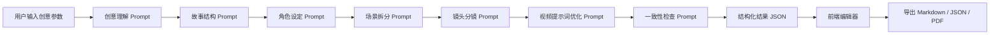

# 技术方案

## 1. 推荐技术栈

### MVP 版本

- 前端：Next.js + React + TypeScript
- UI：Tailwind CSS + shadcn/ui
- 后端：Next.js API Routes
- 数据库：SQLite 或 Supabase
- AI：OpenAI API 或兼容大模型 API
- 导出：Markdown / JSON 优先，PDF 后续加入
- 部署：Vercel

### 为什么这样选

- Next.js 适合快速做可部署 Demo。
- 前后端放在一个项目里，减少工程复杂度。
- Tailwind + shadcn/ui 能快速做出干净的工作台界面。
- SQLite 适合本地 MVP，Supabase 适合后续部署和账号体系。
- AI 生成逻辑先放 API Routes，方便后面替换模型供应商。

## 2. 系统架构



## 3. 核心数据模型

### Project

```ts
type Project = {
  id: string;
  title: string;
  brief: string;
  genre: string;
  style: string;
  duration: number;
  platform: string;
  audience: string;
  protagonist?: string;
  mood: string;
  language: "zh" | "en";
  status: "draft" | "generated" | "exported";
  createdAt: string;
  updatedAt: string;
};
```

### StoryPlan

```ts
type StoryPlan = {
  title: string;
  logline: string;
  synopsis: string;
  threeActStructure: {
    act1: string;
    act2: string;
    act3: string;
  };
  emotionalCurve: string[];
  visualMotifs: string[];
};
```

### Character

```ts
type Character = {
  id: string;
  name: string;
  role: string;
  age?: string;
  identity: string;
  appearance: string;
  personality: string;
  motivation: string;
  visualConsistencyPrompt: string;
  voiceTone: string;
};
```

### Scene

```ts
type Scene = {
  id: string;
  index: number;
  title: string;
  purpose: string;
  location: string;
  timeOfDay: string;
  summary: string;
};
```

### Shot

```ts
type Shot = {
  id: string;
  sceneId: string;
  index: number;
  durationSec: number;
  shotSize: "wide" | "full" | "medium" | "close" | "extremeClose";
  cameraMovement: string;
  visualDescription: string;
  characterAction: string;
  dialogueOrVoiceover: string;
  subtitle: string;
  soundDesign: string;
  videoPrompt: string;
  negativePrompt: string;
  targetTool: "jimeng" | "kling" | "runway" | "nanomovie" | "generic";
};
```

## 4. API 设计

### POST `/api/projects`

创建项目。

### POST `/api/generate/story`

根据用户输入生成故事方案。

### POST `/api/generate/characters`

根据故事方案生成角色卡。

### POST `/api/generate/scenes`

生成分场景脚本。

### POST `/api/generate/shots`

生成镜头分镜。

### POST `/api/regenerate/scene`

局部重生成某个场景。

### POST `/api/regenerate/shot`

局部重生成某个镜头。

### GET `/api/projects/:id/export?format=markdown|json|pdf`

导出项目。

## 5. Prompt 工程原则

- 所有生成结果先要求 JSON，前端再渲染。
- 每一步只做一类任务，避免一个 Prompt 同时负责故事、角色、分镜和提示词。
- 每一步带入上一步结构化结果，保证连续性。
- 对镜头数量做硬约束，例如 60 秒短片生成 8 到 12 个镜头。
- 加一致性检查，避免角色外貌、情绪曲线、时间线互相冲突。

## 6. MVP 开发里程碑

### Milestone 1: 静态原型

- 首页 / 工作台
- 新建项目表单
- 脚本结果页
- 分镜编辑页
- 导出页

### Milestone 2: 本地假数据闭环

- 使用 mock JSON 渲染完整项目。
- 支持编辑镜头字段。
- 支持 Markdown / JSON 导出。

### Milestone 3: 接入 AI

- 接入故事生成 API。
- 接入角色 / 场景 / 镜头生成 API。
- 增加 loading、错误处理、重试。

### Milestone 4: 保存与版本

- 保存项目。
- 保存历史版本。
- 支持局部重生成。

### Milestone 5: 作品集打磨

- 部署上线。
- 录制 Demo。
- 写项目复盘。
- 准备面试讲述稿。
